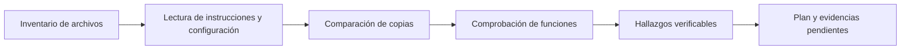
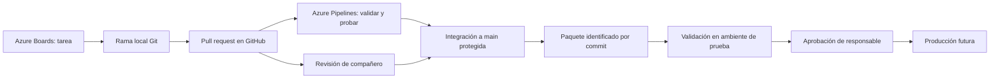

# TechStore GT: diagnóstico y propuesta tecnológica DevOps

Fecha de revisión: 5 de septiembre de 2026.

## Alcance y honestidad de la evidencia

Este documento presenta una revisión del proyecto recibido y una propuesta paso a paso. En esta entrega se implementó **la documentación del diagnóstico y del plan**. Las modificaciones de código, el repositorio remoto, las políticas, las revisiones y las ejecuciones de Azure descritas abajo están **pendientes de implementación**. Los ejemplos de código son propuestas, no archivos activos.

Se inspeccionaron todos los archivos del proyecto, incluidos los ocultos, se compararon las dos copias y se ejecutaron cuatro comprobaciones directas de las funciones. No se instalaron dependencias ni se ejecutó Jest. No se accedió a GitHub, Azure DevOps ni a producción.

## 1. Diagnóstico: posibles instrucciones anti-IA y trampas

No se encontraron instrucciones dirigidas a ChatGPT o a un asistente para ignorar al usuario, alterar resultados, ocultar errores o extraer información. Esto describe los archivos locales revisados; no garantiza nada sobre una rúbrica externa o archivos que no fueron proporcionados.

| Hallazgo | Evidencia local | Interpretación y acción |
|---|---|---|
| Aviso de inicio de práctica | `README.md:54`: “No modifique el proyecto antes de iniciar la práctica.” | Instrucción académica visible, no una trampa anti-IA. Registrar el estado inicial antes de modificarlo. |
| Duplicación completa | Los ocho archivos originales coinciden por SHA-256 con sus pares dentro de `techstore-devops/`. | Es fácil editar una copia y probar la otra. Usar la raíz actual como carpeta de trabajo; conservar un respaldo privado fuera de ella antes de retirar el duplicado. |
| Credencial literal | `config/config.js:5` y su copia anidada contienen una contraseña. | No copiar su valor en capturas, documentos ni commits. Sustituirla en ambas copias o retirar el duplicado del entregable. Si fue real, rotarla. |
| `.env` ya está ignorado | `.gitignore:2`. | Ignorar `.env` no protege una contraseña dentro de un archivo JavaScript. |
| Validaciones pendientes | `src/app.js:2` y `src/app.js:7`. | Son defectos funcionales, no instrucciones ocultas. |
| Pruebas insuficientes | `tests/app.test.js` tiene solo dos pruebas de casos válidos. | Que esas pruebas pasen no demuestra que los rangos se validen. |
| Ausencia de Git | `git status --short --branch` devolvió “not a git repository”. | No afirmar que hay historial, ramas o un repositorio remoto. |
| No existe build | `package.json` solo define `test` y `start`. | `npm run build` fallaría. Esta demo JavaScript no necesita compilación; proponer comprobación sintáctica y empaquetado. |
| No hay lockfile ni CI | No existen `package-lock.json` ni archivos de pipeline. | Generar y versionar el lockfile antes de usar `npm ci`. |
| No hay servidor ni conexión a BD | `src/demo.js` calcula valores e imprime el nombre de la base; no abre conexiones. | No presentar una captura de consola como evidencia de una web o una BD operativa. |

Esquema de revisión:



Comprobaciones ejecutadas sobre el código original:

| Entrada | Resultado observado | Problema |
|---|---:|---|
| `calcularTotal(-100, 2)` | `-200` | Acepta precio negativo. |
| `aplicarDescuento(100, 150)` | `-50` | Acepta descuentos mayores al 100 %. |
| `aplicarDescuento(100, -10)` | `110` | Un descuento negativo aumenta el total. |
| `calcularTotal('100', 2)` | `200` | Convierte texto implícitamente. |

## 2. Propuesta general

Se propone Git para el historial local, GitHub para repositorio y revisiones, Azure Pipelines para integración continua y Azure Boards para pendientes. GitHub y Azure DevOps aparecen en los requisitos del proyecto; esta distribución permite utilizarlos con una responsabilidad clara para cada uno. Se conserva Node.js con Jest para evitar una migración innecesaria.



Los ambientes y el despliegue son una propuesta futura: primero debe existir un destino real. Para esta demo, el resultado técnico inicial es un paquete verificable, no una aplicación web desplegada.

## 3. Paso a paso por problema

### Paso 1. Dejar de compartir carpetas ZIP

**Estado:** propuesto. **Fundamento:** una fuente central reduce la divergencia entre copias y permite identificar quién cambió cada archivo.

1. Guardar una copia privada del material original fuera de la carpeta de trabajo; contiene una credencial y no debe publicarse.
2. Trabajar en `C:\Users\gusta\Downloads\techstore-devops` y comparar antes de retirar la carpeta duplicada `techstore-devops/`.
3. Corregir la credencial mediante el paso 5 **antes del primer commit**.
4. Crear en GitHub un repositorio vacío llamado `techstore-devops`, con visibilidad conforme a la práctica.
5. Tras completar el saneamiento, ejecutar:

```powershell
git init -b main
git add .
git diff --cached --stat
git diff --cached
git commit -m "chore: establecer base saneada de TechStore"
# Reemplazar USUARIO por el propietario real del repositorio.
git remote add origin https://github.com/USUARIO/techstore-devops.git
git push -u origin main
```

Revisar el contenido preparado antes del commit, especialmente configuración y archivos duplicados. Los demás desarrolladores usarán `git clone` con la URL real.

**Esquema:** `Desarrolladores → clone / fetch / push → repositorio central GitHub`.

**Evidencia a obtener:** URL del repositorio, listado saneado y primer commit. No incluir secretos en capturas.

### Paso 2. Establecer control formal de versiones

**Estado:** propuesto. **Fundamento:** cambios pequeños con historial facilitan auditoría, diagnóstico y reversión.

1. Mantener `main` como rama estable y ramas cortas `feature/...`, `fix/...` y `docs/...`.
2. Crear cada cambio desde `main` actualizada:

```powershell
git switch main
git pull --ff-only
git switch -c fix/validar-ventas
```

3. Hacer commits que expliquen el propósito; por ejemplo, `fix: rechazar descuentos fuera de rango`.
4. Publicar la rama y abrir un pull request. Después de integrar y validar una entrega, crear una etiqueta como `v1.0.1` sobre el commit aprobado.
5. Para revertir un cambio integrado, preparar `git revert HASH` en otra rama y someterlo al mismo flujo de revisión.

**Esquema:** `main → fix/validar-ventas → commits → pull request → main → etiqueta`.

**Evidencia a obtener:** `git log --oneline --graph --all`, rama, PR y etiqueta vinculada a un commit real.

### Paso 3. Evitar modificaciones directas a producción

**Estado:** propuesto; no se encontró infraestructura de producción. **Fundamento:** separar permisos y validar antes de desplegar reduce cambios accidentales y permite recuperar una versión conocida.

1. Proteger `main` mediante una regla que requiera pull request, aprobación y estado satisfactorio de CI. Deshabilitar force push, borrados y excepciones de bypass donde corresponda.
2. Confirmar que el plan y la visibilidad del repositorio permiten aplicar las reglas. GitHub documenta las capacidades y restricciones en [ramas protegidas](https://docs.github.com/en/repositories/configuring-branches-and-merges-in-your-repository/managing-protected-branches/about-protected-branches).
3. Cuando exista un destino, separar desarrollo, pruebas y producción. Los desarrolladores no deben tener escritura rutinaria directa en producción.
4. Dar a la identidad de despliegue solo los permisos necesarios. Exigir aprobación del responsable antes de producción y promover el mismo paquete probado.
5. Conservar el paquete anterior y documentar cómo reinstalarlo si falla la verificación posterior. Cualquier migración de datos requerirá su propio plan de reversión.

**Esquema:** `Desarrollo → CI → paquete → pruebas → aprobación → producción → verificación / reversión`.

**Evidencia a obtener:** regla activa, PR bloqueado sin controles, permisos de ambiente y registro de aprobación. Una política escrita por sí sola no demuestra cumplimiento.

### Paso 4. Ordenar los archivos

**Estado:** duplicación comprobada; reorganización propuesta. **Fundamento:** una estructura única elimina ambigüedad al ejecutar comandos y separa responsabilidades.

Estructura objetivo:

```text
techstore-devops/
├── .github/pull_request_template.md
├── config/config.js
├── docs/
│   ├── PROPUESTA_DEVOPS_PASO_A_PASO.md
│   ├── CONTRIBUTING.md
│   └── OPERACION.md
├── src/
│   ├── app.js
│   └── demo.js
├── tests/app.test.js
├── .env.example
├── .gitignore
├── azure-pipelines.yml
├── package-lock.json
├── package.json
└── README.md
```

1. Conservar una sola copia de `src`, `tests` y `config`.
2. Mantener `node_modules/`, `coverage/` y `.env` fuera de Git; añadir `dist/`, `*.tgz`, `.env.*` y una excepción `!.env.example` si se utilizan esos archivos.
3. No mover secretos a una carpeta versionada llamada `backup` o `legacy`.

**Evidencia a obtener:** árbol final del repositorio y comparación del duplicado antes de retirarlo. La estructura anterior es el esquema de este punto.

### Paso 5. Sacar las contraseñas del código

**Estado:** defecto confirmado; corrección propuesta. **Fundamento:** separar secretos de código permite variar ambientes sin publicar credenciales.

1. Sustituir `config/config.js` por una configuración basada en variables de entorno:

```javascript
module.exports = {
  database: process.env.DB_NAME || 'techstore',
  host: process.env.DB_HOST || 'localhost',
  user: process.env.DB_USER,
  password: process.env.DB_PASSWORD
};
```

2. Crear `.env.example` sin valores sensibles:

```dotenv
DB_NAME=techstore
DB_HOST=localhost
DB_USER=
DB_PASSWORD=
```

3. Usar variables de entorno locales o copiar el ejemplo a `.env` e iniciar con `node --env-file=.env src/demo.js`. El actual `npm start` no carga `.env` automáticamente.
4. Si posteriormente se implementa la conexión a BD, validar que las credenciales necesarias existan antes de conectar. La demo actual no necesita una contraseña para calcular ventas.
5. En un despliegue real, inyectar credenciales desde variables secretas del servicio o un gestor de secretos, sin imprimirlas. CI no necesita credenciales de producción para estas pruebas.
6. Si la contraseña original tuvo uso real, cambiarla en el servicio correspondiente. Borrarla del archivo no invalida copias anteriores; si ya se publicó, revisar también historial y accesos.

**Esquema:** `Variable local / almacén de secretos → process.env → configuración → conexión futura`.

**Evidencia a obtener:** diff saneado y ejemplo sin secretos. No mostrar el valor de una variable secreta para demostrar su existencia.

### Paso 6. Introducir revisión de código

**Estado:** propuesto. **Fundamento:** una segunda persona puede detectar errores y compartir conocimiento antes de integrar.

1. Añadir `.github/pull_request_template.md` con problema, cambio, pruebas, riesgos y tarea relacionada.
2. Pedir al menos una revisión independiente; resolver comentarios antes de integrar.
3. Exigir aprobación y CI mediante la regla de `main`. Tras la primera ejecución, seleccionar el estado real que reporta Azure; no inventar su nombre.
4. Invalidar aprobaciones obsoletas cuando cambie el código si esa es la política configurada.

Plantilla propuesta:

```markdown
## Problema y tarea relacionada
## Cambio realizado
## Cómo se verificó
## Riesgos y reversión
```

**Esquema:** `Autor → PR → compañero revisa → correcciones → aprobación + CI → merge`.

**Evidencia a obtener:** enlace al PR, comentarios, aprobación de otra persona y controles aprobados. Si trabajas solo, declara que la revisión independiente sigue pendiente.

### Paso 7. Implementar integración continua

**Estado:** pipeline propuesto, no ejecutado. **Fundamento:** comprobar cada cambio en un ambiente limpio evita depender de la configuración de una sola computadora.

1. Generar `package-lock.json` con `npm install`, revisar y versionar el resultado. Este comando es un paso pendiente.
2. Incorporar el script `check` del paso 10 a `package.json`.
3. Crear `azure-pipelines.yml` con este contenido inicial para un repositorio alojado en GitHub:

```yaml
trigger:
  branches:
    include:
      - main
pr:
  branches:
    include:
      - main

pool:
  vmImage: ubuntu-latest

steps:
  - task: NodeTool@0
    inputs:
      versionSpec: '24.x'
    displayName: Preparar Node.js

  - script: npm ci
    displayName: Instalar dependencias del lockfile

  - script: npm run check
    displayName: Comprobar sintaxis

  - script: npm test -- --ci --runInBand --coverage
    displayName: Ejecutar pruebas

  - script: |
      mkdir -p "$(Build.ArtifactStagingDirectory)/package"
      npm pack --pack-destination "$(Build.ArtifactStagingDirectory)/package"
      printf '%s\n' "$(Build.SourceVersion)" > "$(Build.ArtifactStagingDirectory)/package/commit.txt"
    displayName: Empaquetar versión comprobada
    condition: and(succeeded(), eq(variables['Build.SourceBranch'], 'refs/heads/main'))

  - task: PublishPipelineArtifact@1
    inputs:
      targetPath: '$(Build.ArtifactStagingDirectory)/package'
      artifact: 'techstore-$(Build.BuildId)'
    condition: and(succeeded(), eq(variables['Build.SourceBranch'], 'refs/heads/main'))
```

4. En Azure DevOps, crear o seleccionar el proyecto; en Pipelines crear una pipeline, conectar el repositorio GitHub autorizado y seleccionar el YAML existente.
5. Comprobar disponibilidad de agente y permisos de la conexión. Ejecutar y revisar cada paso.
6. Abrir un PR con una prueba que falle de forma controlada y comprobar el bloqueo; corregirla y verificar que pasa antes de integrar.

Microsoft documenta la configuración de [pipelines para JavaScript](https://learn.microsoft.com/en-us/azure/devops/pipelines/ecosystems/customize-javascript?view=azure-devops). La configuración propuesta debe validarse en la cuenta real. Tener un YAML en disco no demuestra que CI esté activa.

**Esquema:** `Push / PR → Node → npm ci → sintaxis → Jest → paquete solo en main`.

**Evidencia a obtener:** URL de ejecución, commit, pasos y resultado. Guardar una ejecución fallida y su corrección; no fabricar capturas verdes.

### Paso 8. Reducir la dependencia de una sola persona

**Estado:** este diagnóstico ya está documentado; transferencia operativa pendiente. **Fundamento:** procedimientos verificables permiten que otras personas mantengan el sistema.

1. Actualizar README con instalación, versión de Node, comandos, estructura y límites de la demo.
2. Crear `docs/CONTRIBUTING.md` con ramas, commits, PR y criterios de revisión.
3. Crear `docs/OPERACION.md` con empaquetado, configuración, diagnóstico y, cuando exista, despliegue y reversión.
4. Registrar decisiones técnicas y responsables por rol, con sustituto.
5. Pedir a otra persona clonar y ejecutar siguiendo solo la documentación; registrar dudas y corregirlas.

**Esquema:** `Conocimiento individual → documentación en Git → práctica de compañero → mejoras compartidas`.

**Evidencia a obtener:** archivos versionados y registro de la prueba de incorporación de un compañero.

### Paso 9. Convertir TODO en trabajo verificable

**Estado:** fallos reproducidos; solución propuesta. **Fundamento:** cada pendiente necesita responsable y criterio de aceptación, no solo un comentario.

Registrar en Azure Boards estas tareas y enlazarlas manualmente con sus PR:

| Tarea | Prioridad | Criterio de aceptación |
|---|---|---|
| Validar precios | Alta | Rechazar valores negativos, texto, NaN e infinito; aceptar cero. |
| Validar cantidades | Alta | Rechazar negativos, fracciones y valores no numéricos; aceptar cero. |
| Validar descuentos | Alta | Admitir solo números finitos entre 0 y 100 inclusive. |
| Retirar credencial | Alta | No quedar credenciales literales en el repositorio ni duplicados publicados. |
| Activar CI y PR | Alta | Un fallo de pruebas bloquea la integración. |
| Completar documentación | Media | Otra persona puede instalar y ejecutar con las instrucciones. |

La cantidad entera y la aceptación de cero son decisiones propuestas para ventas de unidades; confirmarlas con el docente o negocio antes de adoptarlas como requisitos.

Ejemplo propuesto para `src/app.js`:

```javascript
function noNegativo(valor, nombre) {
  if (!Number.isFinite(valor) || valor < 0) {
    throw new RangeError(`${nombre} debe ser un número finito no negativo`);
  }
}

function calcularTotal(precio, cantidad) {
  noNegativo(precio, 'precio');
  noNegativo(cantidad, 'cantidad');
  if (!Number.isSafeInteger(cantidad)) {
    throw new RangeError('cantidad debe ser un entero seguro');
  }
  const total = precio * cantidad;
  noNegativo(total, 'total');
  return total;
}

function aplicarDescuento(total, porcentaje) {
  noNegativo(total, 'total');
  noNegativo(porcentaje, 'porcentaje');
  if (porcentaje > 100) {
    throw new RangeError('porcentaje no debe superar 100');
  }
  return total - total * (porcentaje / 100);
}

module.exports = { calcularTotal, aplicarDescuento };
```

Añadir a Jest pruebas de cero, límites 0 y 100, negativos, texto, NaN, infinito y cantidad fraccionaria. Ejemplo:

```javascript
test.each([-1, 101, NaN, Infinity, '10'])('rechaza descuento %s', (valor) => {
  expect(() => aplicarDescuento(100, valor)).toThrow();
});
test('permite descuento completo', () => {
  expect(aplicarDescuento(100, 100)).toBe(0);
});
test('rechaza precio negativo', () => {
  expect(() => calcularTotal(-1, 2)).toThrow();
});
```

Para dinero real falta acordar representación en centavos y redondeo; estas validaciones no resuelven por sí solas la precisión decimal.

**Esquema:** `TODO → tarea con criterio → rama → prueba que reproduce fallo → solución → PR → cierre`.

**Evidencia a obtener:** tarea, prueba fallida antes de la corrección, prueba aprobada después y PR asociado. Retirar el TODO solo tras verificar su criterio.

### Paso 10. Automatizar la preparación de la aplicación

**Estado:** propuesto. **Fundamento:** los comandos comunes reducen diferencias entre desarrolladores y CI. JavaScript se ejecuta directamente en este proyecto; no se inventará una compilación que no existe.

1. Agregar a `scripts` de `package.json`, conservando los actuales:

```json
"check": "node --check src/app.js && node --check src/demo.js && node --check config/config.js",
"verify": "npm run check && npm test -- --ci --runInBand"
```

2. Agregar al nivel principal de `package.json` una lista explícita de contenido del paquete:

```json
"files": ["src/", "config/", "README.md"],
"engines": { "node": "24.x" }
```

3. Documentar la versión usada; en esta revisión estaban disponibles Node `v24.18.0`, npm `11.16.0` y Git `2.49.0.windows.1`. Para repetibilidad más estricta, fijar también la versión del entorno CI después de verificarla.
4. Ejecutar `npm ci`, `npm run verify`, `npm start` y `npm pack --dry-run`.
5. Revisar que el paquete no incluya `.env`, duplicados ni credenciales; después ejecutar `npm pack`.
6. En un directorio de prueba, extraer el paquete y ejecutar `node src/demo.js`: para los datos de la demo, subtotal 750 y total 675. Registrar el commit y paquete probados.

`npm pack` produce un archivo local; no publica en el registro npm. El lockfile versionado fija las dependencias de la validación. La demo actual no tiene dependencias de ejecución; si se agregan, habrá que diseñar también su instalación reproducible en el destino.

**Esquema:** `Código + lockfile → instalación limpia → sintaxis y pruebas → paquete → prueba de ejecución`.

**Evidencia a obtener:** salida real de comandos, listado del paquete, identificador de commit y prueba del paquete extraído.

### Paso 11. Mantener la transformación DevOps

**Estado:** propuesta organizativa. **Fundamento:** las herramientas requieren hábitos, responsables y retroalimentación.

1. Primera etapa: sanear credenciales y duplicados, establecer Git y documentación básica.
2. Segunda etapa: completar validaciones, pruebas y revisión de código.
3. Tercera etapa: activar CI, bloquear integraciones defectuosas y producir paquetes trazables.
4. Cuarta etapa: cuando exista una aplicación desplegable, configurar ambientes, aprobación, observación y reversión.
5. Revisar semanalmente tiempo desde PR hasta integración, porcentaje de ejecuciones fallidas y pendientes cerrados. Medir fallos de despliegue y tiempo de recuperación solo cuando existan despliegues reales.

**Esquema:** `Planificar → desarrollar → revisar → validar → entregar → observar → mejorar → planificar`.

**Evidencia a obtener:** tablero con responsables, acuerdos de equipo y métricas calculadas desde registros reales. No inventar mejoras porcentuales sin una línea base.

## 4. Orden recomendado de ejecución

Aunque el documento está organizado por los problemas de la consigna, el orden seguro de la práctica es:

1. Registrar estado inicial y guardar respaldo privado.
2. Unificar la carpeta y retirar la credencial del código.
3. Inicializar Git con una base saneada y conectar GitHub.
4. Crear rama, lockfile, scripts, validaciones y pruebas.
5. Añadir documentación y YAML; revisar por PR.
6. Conectar Azure Pipelines y ejecutar CI.
7. Exigir revisión y el estado real de CI en `main`.
8. Demostrar un bloqueo, corregirlo e integrar con aprobación.
9. Empaquetar y probar el artefacto asociado al commit.
10. Completar el informe con evidencias reales; dejar despliegue como propuesta si no se realizó.

## 5. Registro de evidencias para la entrega

| ID | Evidencia | Estado en esta entrega |
|---|---|---|
| E01 | Inventario y lectura de archivos | Verificado localmente. |
| E02 | Comparación SHA-256 de ocho pares | Verificado: los ocho pares son idénticos. |
| E03 | Cuatro entradas inválidas aceptadas | Verificado; resultados en sección 1. |
| E04 | Historial Git y repositorio GitHub | Pendiente. |
| E05 | Código saneado y estructura única | Pendiente. |
| E06 | PR con revisión independiente | Pendiente. |
| E07 | Regla de protección y bloqueo real | Pendiente. |
| E08 | Pipeline fallida y corregida | Pendiente. |
| E09 | Paquete y ejecución del paquete | Pendiente. |
| E10 | Tablero y transferencia de conocimiento | Pendiente. |
| E11 | Aprobación y despliegue a producción | No realizado; propuesta futura. |

Para cada evidencia posterior registrar fecha, comando o URL, commit y resultado. Sustituir “propuesto” por “implementado” únicamente cuando exista evidencia verificable. Los diagramas representan el diseño; no sustituyen los registros de ejecución.
